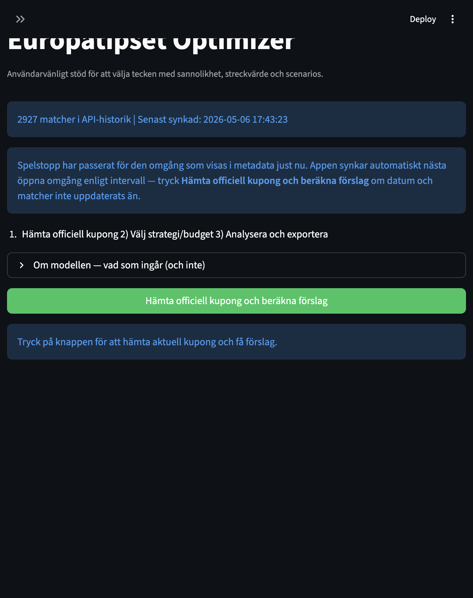

# Europatipset Optimizer

A Python + Streamlit app that helps you build **Europatipset** systems under a row budget, using calibrated 1X2 probabilities, public Svenska Spel signals, and a play journal that learns from past rounds.



## About

**Europatipset Optimizer** is a decision-support tool for the Swedish pool game *Europatipset*. It does not place bets for you; it suggests sign combinations (1 / X / 2), estimates how likely your system is to reach the **payout zone** (10+ correct signs on a single row), and compares budget scenarios.

The optimizer is tuned for a lesson that is easy to forget: **many correct columns can still pay 0 kr** if no single row reaches 10 correct. Built-in analysis from [Week 22 (2026-05-27)](docs/lessons/europatipset_v2026-22.json) and your **My plays** journal gradually calibrate the **Safe** strategy toward more hedging and fewer risky spikes.

**Live app:** [https://europatipset-optimizer.streamlit.app](https://europatipset-optimizer.streamlit.app)

> Hosted on Streamlit Community Cloud. The app may prompt for login depending on workspace settings; all core features run in the browser after load.

**Repository:** [https://github.com/Elli2022/europatipset-optimizer](https://github.com/Elli2022/europatipset-optimizer)

## Why this approach?

- **Market odds** are the strongest baseline signal for match outcomes.
- **Historical results** calibrate raw implied probabilities (logistic regression on football-data.co.uk).
- **Public Svenska Spel data** (streck, favourites, newspaper tips when present) is blended into the model.
- **System building** maximizes the chance of **≥10 correct on at least one row**, not just “most columns covered”.
- **Play journal** records settled rounds and nudges future **Safe** / **Balanced** picks away from fragile single spikes.

## Features (web UI)

- Fetch the **official coupon** (odds + streck) from Svenska Spel’s public tips JSON
- Choose **row budget** and strategy: **Balanced**, **Safe**, or **Value**
- **System suggestion** table with model probabilities and value vs streck
- **Budget comparison**, **hit forecast** (Monte Carlo, including **P(≥10 correct)**)
- **Payout calculator** (pool share scenarios)
- **Match analysis** with free-tier league table + form (football-data.org)
- **My plays**: save coupons, settle with outcomes, personal learning hints
- **Backtest** CLI for ROI / hit-rate ablation across signal profiles

## Quick start (local)

```bash
python3 -m venv .venv
source .venv/bin/activate
pip install -r requirements.txt
streamlit run streamlit_app.py
```

Open [http://localhost:8501](http://localhost:8501).

Optional API key for form/standings sync:

```bash
export FOOTBALL_DATA_API_KEY="your_key"
```

## CLI workflow

### 1) Download history

```bash
python europatipset.py download --out data/raw/history.csv --years 6
```

### 2) Sync recent results (free API)

```bash
export FOOTBALL_DATA_API_KEY="your_key"
python europatipset.py sync-free-api-history --out data/raw/history_api.csv --days-back 120
```

### 3) Train calibration model

```bash
python europatipset.py train --history data/raw/history.csv --model data/models/calibration.pkl
```

### 4) Recommend a system

```bash
python europatipset.py recommend \
  --coupon coupon_template.csv \
  --model data/models/calibration.pkl \
  --max-rows 64 \
  --strategy safe \
  --game-type europatipset \
  --out data/output/recommendation.csv
```

### Official coupon from Svenska Spel

```bash
python europatipset.py build-official-coupon --out data/input/official_coupon.csv
python europatipset.py recommend \
  --coupon data/input/official_coupon.csv \
  --model data/models/calibration.pkl \
  --max-rows 64 \
  --out data/output/recommendation_official.csv
```

### Backtest

```bash
python europatipset.py backtest \
  --history data/raw/history.csv \
  --model data/models/calibration.pkl \
  --out data/output/backtest.csv \
  --budgets 32,64,128 \
  --strategies balanced,safe,value \
  --game-type europatipset \
  --n-coupons 50
```

## Deploy

See [DEPLOY_CHECKLIST.md](DEPLOY_CHECKLIST.md) for Streamlit Community Cloud setup (secrets, smoke tests, play journal on `localStorage`).

**Production URL:** [https://europatipset-optimizer.streamlit.app](https://europatipset-optimizer.streamlit.app)

## Coupon CSV format

Required columns:

| Column | Description |
|--------|-------------|
| `Match` | Home - Away |
| `Odd1`, `OddX`, `Odd2` | Decimal odds |

Optional: `Streck1`, `StreckX`, `Streck2` (percent as `52` or fraction `0.52`).

## Tests

```bash
pytest
```

## MVP limitations

- `build-coupon` uses football-data.co.uk fixtures, not the exact Europatipset draw.
- `build-official-coupon` reads Svenska Spel’s statistics page / embedded tips state.
- Training history is European leagues from football-data.co.uk, not Europatipset-only results.
- Free API sync has no bookmaker odds—only finished match results.
- Payout simulation in the UI is scenario-based; real pools depend on turnover and winners at each level.
- The model cannot see late team news, lineups, or xG dashboards unless you add manual adjustments in the UI.

## License

Use responsibly. Pool games involve financial risk; this project is for analysis and education only.
